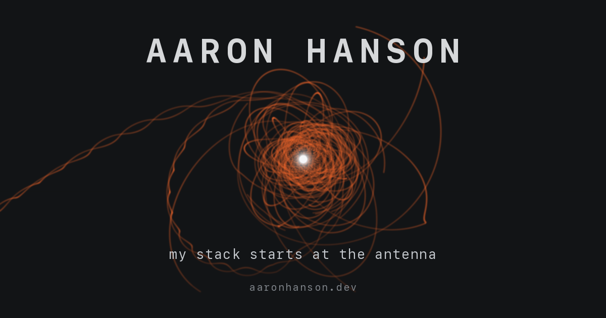

# aaronhanson.dev

**▶ Live: [aaronhanson.dev](https://aaronhanson.dev)**



One small, dependency-free HTML page. No framework, no build step, no tracking. The
page is [`public/index.html`](public/index.html): one request, one round trip,
favicon inlined as a data URI. Around it sit the usual web-hygiene files
(sitemap, robots, `llms.txt`, `security.txt`, a 404) and hardened response
headers. Every claim on the page is checkable; that is the point.

## Layout

Everything Vercel serves lives in `public/`. The dev tooling sits at the repo
root and is never deployed (Vercel's Root Directory is set to `public`).

| Path | What it is |
|------|-----------|
| `public/index.html` | The site. Single file, self-stamped, meant to be read in view-source. |
| `public/resume.pdf` | Two-page resume, phone scrubbed. Served at `/resume.pdf`. Generated (see below). |
| `public/og.png` | Social-share image referenced by `og:image`. Generated by `make-og.py`. |
| `public/llms.txt` | Agent-readable summary (llmstxt.org). Curated subset of the page; keep in sync. |
| `public/robots.txt`, `public/sitemap.xml` | Crawler hygiene. |
| `public/404.html` | On-brand 404. Its inline `<style>` is CSP-pinned like the page's. |
| `public/.well-known/security.txt` | Security contact + PGP key reference (RFC 9116). |
| `public/.well-known/pgp-key.txt` | Public PGP key. |
| `public/vercel.json` | Response headers: strict hash-pinned CSP, HSTS, nosniff, frame-deny. |
| `check.sh` | **Verify only.** Confirms the page's self-referential claims still hold. |
| `stamp.py` | **Dev helper (writes).** Re-stamps the byte count + ratio, re-pins CSP hashes. |
| `make-og.py` | **Dev helper (writes).** Regenerates `public/og.png`. |
| `cspsum.py` | **Dev helper.** Pins inline `<script>`/`<style>` sha256 into `vercel.json`; `stamp.py` calls it, `check.sh` verifies. |
| `docs/` | Non-deployed backups: Zenith audit PDF, headshot, archived Nifty post. |

## The self-referential numbers

The page states its own size (`[ N,NNN bytes ]`) and how many times it fits
in 64 KB of memory (`65536 / bytes`). If you edit any copy:

```sh
python3 stamp.py   # rewrites both numbers, and re-pins the CSP hashes in vercel.json
./check.sh         # verifies badge, ratio, round-trip, CSP hashes, security.txt expiry
```

`check.sh` never writes; it is safe to run in CI as a deploy gate. A stale
badge or a page that no longer fits one round trip (brotli < 14 KiB) fails it.

## The resume

`public/resume.pdf` is generated from the source of truth in the sibling resume
repo, with the phone number scrubbed:

```sh
../resume/build-web-resume.sh   # derives from resume-general.typ -> public/resume.pdf
```

The PDF is committed so the static site deploys without needing typst. After
editing the resume source material, re-run that script and commit the result.

## Keeping content in sync

Project and work items appear in more than one place. When you add, remove, or
reword a notable one, update all of them so they don't drift:

- `public/index.html`: SIDE WORK and HISTORY. The canonical list.
- `public/llms.txt`: a *curated* subset for agents (substantive items only, not a
  1:1 mirror). Must never contradict the page.
- `../resume/*.typ`: the same projects on the resumes (separate repo).

## Local preview

```sh
python3 -m http.server 8123 --bind 127.0.0.1 --directory public
```

## Deploy

Vercel, framework preset **Other**, **Root Directory = `public`**, no build
command, no output directory. That scopes the deploy to `public/`, so the dev
scripts at the repo root are never uploaded or served. Domain: aaronhanson.dev.

## License

The code and tooling (the page markup, `check.sh`, `stamp.py`, `cspsum.py`,
`make-og.py`, config) are [MIT](LICENSE) - take the one-packet page technique,
the CSP hash-pinning, or the self-referential byte badge and use them freely.

Not covered by MIT: the personal content (resume, bio, headshot, `og.png`) is
copyright Aaron Hanson, and the files under `docs/` are third-party material
kept for reference and remain the property of their owners (the Nifty Gateway
post is copyright Nifty Gateway; the Zenith report is copyright Zenith).
